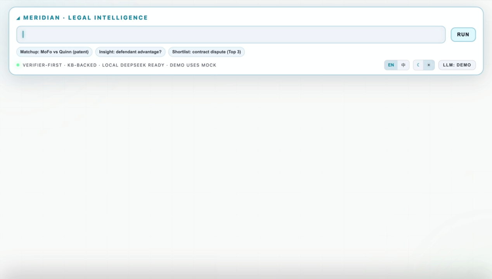

# Legal Intelligence Workbench

> **Next-Generation Litigation Analytics Platform**
> Transforming raw litigation data into actionable legal intelligence through advanced computational methods and AI-powered insights.

[](https://react.dev/)
[](https://vitejs.dev/)
[](https://tailwindcss.com/)
[](https://js.cytoscape.org/)
[](https://opensource.org/licenses/MIT)

> **Note:** This is a proof-of-concept developed in a rapid prototyping sprint. Intended for research demonstration and educational purposes. Not production-ready.

<p align="center">
  
  
</p>

---

## Overview

**Legal Intelligence Workbench** is a sophisticated litigation analytics platform that applies **computational law methodologies** to transform complex legal outcome data into evidence-backed strategic insights. The platform leverages cutting-edge web technologies, interactive data visualization, and LLM-powered analysis to deliver unprecedented transparency into law firm competitive dynamics.

> **Disclaimer:** This is an unofficial, open-source implementation inspired by the outcome-based ranking algorithms described in Mahari et al. (2025). It is intended for educational and research visualization purposes only.

### Core Innovation

Traditional law firm rankings rely on reputation surveys and revenue metrics—proxies that weakly correlate with actual litigation performance. This platform introduces an **outcome-based ranking methodology** inspired by:

- **Bradley-Terry Models** — Pairwise comparison frameworks adapted from sports analytics
- **AHPI (Adjusted Head-to-Head Performance Index)** — Novel metrics for legal adversarial outcomes
- **Network Analysis** — Graph-theoretic approaches to map firm rivalry ecosystems

**Research Alignment:**
- *Nature Computational Science*: Data-driven law firm rankings (treating each litigation as a plaintiff/defendant pairwise game)
- *Federal Sentencing Reporter*: EU AI Act compliance with explainable, traceable analysis pipelines

---

## Key Features

### 1. Interactive Multi-View Visualization Engine

| View | Description |
|------|-------------|
| **Force-Directed Network** | Dynamic graph visualization of plaintiff-defendant relationships with physics simulation |
| **Adjacency Matrix** | Heatmap representation for dense rivalry pattern identification |
| **Dot Plot Analytics** | Statistical distribution analysis across case types and courts |
| **Data Table** | Sortable, filterable tabular interface with real-time search |

### 2. AI-Powered Legal Intelligence

- **LLM Integration** — OpenAI-compatible API with streaming response support
- **Grounded Insights** — Prompts injected with filtered case data (CSV) to prevent hallucination
- **Structured Output Parsing** — Extracts entities, claims, and evidence references from LLM responses
- **Multi-Stage Reasoning Visualization** — Real-time display of AI thinking process with 6-phase progress tracking
- **Think Block Parsing** — Separates reasoning traces from final outputs for transparency

### 3. Robustness & Reproducibility Framework

- **Sensitivity Analysis** — Parameter variation testing across multiple configurations
- **Null Control Testing** — Randomization-based significance testing (p-value computation)
- **Evidence Traceability** — Every claim linked to specific case records (RowIds)
- **Export Capabilities** — Markdown reports and JSON data for peer review
- **URL State Synchronization** — Reproducible analysis via shareable links

### 4. Dual-Mode Interface

- **J2 Neural Interface** — Immersive command-deck experience for presentations and demos
- **Workbench Mode** — Full-featured analytical environment for deep exploration
- **Seamless Embedding** — iframe-compatible architecture for enterprise integration
- **Dark/Light Themes** — Professional appearance for any context

### 5. Multi-Agent Analysis Architecture (J2-Style)

The platform implements a **verifier-first multi-agent pipeline** that decomposes complex legal analytics into specialized, orchestrated agents:

```
┌──────────────────────────────────────────────────────────────┐
│  🖥️  J2 Neural Command Deck (Typewriter Animation)           │
├──────────────────────────────────────────────────────────────┤
│                                                              │
│  ┌─────────────┐  ┌─────────────┐  ┌─────────────┐          │
│  │  Agent 1    │  │  Agent 2    │  │  Agent 3    │          │
│  │  KB Loader  │→ │  Verifier   │→ │  Synthesis  │→  ...    │
│  │             │  │             │  │             │          │
│  └─────────────┘  └─────────────┘  └─────────────┘          │
│       ↓                ↓                ↓                    │
│  Progress Bar    Progress Bar    Progress Bar               │
│                                                              │
├──────────────────────────────────────────────────────────────┤
│  [Open Workbench →]  Deep-link with analysis state           │
└──────────────────────────────────────────────────────────────┘
```

**Agent Pipeline:**

| Agent | Responsibility | Status |
|-------|----------------|--------|
| **Agent 1 · KB Loader** | Load Harvard CAP database, sync 60,000+ litigation records | ✅ Implemented |
| **Agent 2 · Verifier** | Cross-reference precedents, verify citation integrity, hallucination check | ✅ Implemented |
| **Agent 3 · Synthesis** | Compute Bayesian inference, generate confidence scores, neural synthesis | ✅ Implemented |
| **Agent 4 · Workbench Handoff** | Transfer analysis state, deep-link into Explorer with pre-populated filters | ✅ Implemented |

**Key Features:**
- **Verifier-First Pipeline** — Every claim verified against Harvard CAP before presentation
- **Evidence-Bound Claims** — All insights linked to specific case IDs
- **Hallucination Detection** — Zero-tolerance policy with visual verification badges
- **Confidence Scoring** — Bayesian inference with uncertainty quantification
- **Seamless Handoff** — One-click transition from demo to full workbench with state preservation

This architecture ensures **explainable, auditable, and trustworthy** legal intelligence — critical for enterprise and regulatory compliance (EU AI Act).

---

## Technical Architecture

```
┌─────────────────────────────────────────────────────────────────┐
│                     Legal Intelligence Workbench                 │
├─────────────────────────────────────────────────────────────────┤
│  ┌─────────────┐  ┌─────────────┐  ┌─────────────────────────┐  │
│  │   J2 Demo   │  │  Workbench  │  │     Shared Components   │  │
│  │  Interface  │◄─┤    Core     │◄─┤  • InsightsPanel        │  │
│  │             │  │             │  │  • NetworkView          │  │
│  └──────┬──────┘  └──────┬──────┘  │  • MatrixView           │  │
│         │                │         │  • DotPlotView          │  │
│         ▼                ▼         │  • TableView            │  │
│  ┌─────────────────────────────┐   │  • LlmPanel             │  │
│  │      PostMessage Bridge     │   └─────────────────────────┘  │
│  │   (iframe ↔ parent sync)    │                                │
│  └─────────────────────────────┘                                │
├─────────────────────────────────────────────────────────────────┤
│                        Data Layer                                │
│  ┌─────────────┐  ┌─────────────┐  ┌─────────────────────────┐  │
│  │   Filters   │  │  Analytics  │  │      LLM Client         │  │
│  │   Engine    │  │   Engine    │  │  • OpenAI Compatible    │  │
│  │             │  │  • Ranking  │  │  • Streaming Support    │  │
│  │  • URL Sync │  │  • Network  │  │  • Mock Fallback        │  │
│  │  • Presets  │  │  • Stats    │  │  • Think Block Parser   │  │
│  └─────────────┘  └─────────────┘  └─────────────────────────┘  │
└─────────────────────────────────────────────────────────────────┘
```

### Technology Stack

| Layer | Technologies |
|-------|--------------|
| **Frontend Framework** | React 19.2, Vite 7, ES2024+ |
| **Network Visualization** | Cytoscape.js 3, Recharts 3, Custom SVG Components |
| **Styling** | TailwindCSS 4, CSS Custom Properties, Dark/Light Themes |
| **State Management** | React Hooks, URL State Synchronization |
| **AI Integration** | OpenAI-compatible API, Streaming Responses, Mock Fallback |
| **Build & Deploy** | Vite, ESBuild, Static Export |
| **Internationalization** | Runtime EN/ZH switching with `useI18n` hook |

---

## Quick Start

### Prerequisites

- Node.js 18+ (LTS recommended)
- pnpm 8+ (recommended) or npm

### Installation

```bash
# Clone the repository
git clone https://github.com/your-org/legal-intelligence-workbench.git
cd legal-intelligence-workbench

# Install dependencies
pnpm install

# Start development server
pnpm dev
```

### Demo Mode

For stable presentations with pre-loaded sample data:

```bash
pnpm dev:demo
```

Or append `?demo=1` to any URL.

### Environment Configuration

Create a `.env.local` file for LLM integration (optional):

```env
VITE_LLM_API_URL=https://api.openai.com/v1
```

> **Note:** If `VITE_LLM_API_URL` is empty or the API fails, the system automatically falls back to **Demo Mock output** with realistic thinking traces and structured claims.

### Build for Production

```bash
pnpm build
pnpm preview
```

---

## Data Input

### Supported Formats
- CSV (comma-separated)
- TSV (tab-separated)

### Field Mapping

| Field | Required | Description |
|-------|----------|-------------|
| `Plaintiff firm` | Yes | Law firm representing plaintiff |
| `Defendant firm` | Yes | Law firm representing defendant |
| `Case type` | No | Litigation category (e.g., Patent, Antitrust) |
| `Court` | No | Jurisdiction or court name |
| `Outcome` | No | Case result for stratified analysis |
| `Weight` | No | Edge weight for visualization (defaults to 1) |

### Sample Data

Built-in sample datasets available via the UI:
- **Quick Demo** — `mahari_lawsuits_example.csv`
- **Fig.2 Source** — `mahari_fig2_moesm4_interactions.csv`

---

## Citation Verification System

Every analytical claim maintains full evidence traceability:

- **RowId Linking** — Click any insight to reveal source records
- **Visual Highlighting** — Selected edges highlight across all views simultaneously
- **Export Chain** — JSON exports include complete evidence references
- **Audit Trail** — Reproducible via URL state

---

## Research Applications

### Empirical Legal Studies
- Quantify litigation outcome patterns across jurisdictions
- Identify systematic advantages by firm size, specialization
- Track temporal evolution of competitive dynamics

### Legal Market Intelligence
- Evidence-based law firm selection for corporate counsel
- Competitive benchmarking for firm strategy teams
- M&A due diligence on litigation track records

### Academic Research
- Reproducible methodology with full parameter transparency
- Statistical robustness testing built-in
- Export formats compatible with R/Python analysis pipelines

---

## Project Structure

```
src/
├── components/           # React UI components
│   ├── NetworkView.jsx   # Force-directed graph (D3.js)
│   ├── MatrixView.jsx    # Adjacency heatmap
│   ├── DotPlotView.jsx   # Statistical dot plots
│   ├── TableView.jsx     # Filterable data table
│   ├── InsightsPanel.jsx # AI insights & robustness reports
│   ├── LlmPanel.jsx      # LLM configuration & testing
│   └── ThinkBlock.jsx    # AI reasoning visualization
├── lib/                  # Core utilities
│   ├── analytics.js      # Ranking algorithms
│   ├── llmClient.js      # OpenAI-compatible API client
│   ├── llmThink.js       # Think block parser
│   ├── robustness.js     # Statistical testing
│   ├── i18n.js           # Internationalization
│   └── filters.js        # URL state management
├── j2/                   # Demo interface
│   └── main.js           # Neural command deck
├── styles.css            # Global styles & themes
└── App.jsx               # Main application shell
```

---

## Performance Characteristics

- **Scalability** — Handles 10,000+ litigation records smoothly
- **Responsive Design** — Optimized for desktop to tablet viewports
- **Lazy Loading** — Code-split visualization components
- **Memoization** — Strategic `useMemo` for expensive computations

---

## Contributing

We welcome contributions from the computational law and legal tech communities.

1. Fork the repository
2. Create a feature branch (`git checkout -b feature/amazing-feature`)
3. Commit your changes (`git commit -m 'Add amazing feature'`)
4. Push to the branch (`git push origin feature/amazing-feature`)
5. Open a Pull Request

---

## Engineering Methodology

This project was developed using an **AI-Native Workflow** (Cursor + Local LLMs) within a **48-hour sprint**.

| Aspect | Approach |
|--------|----------|
| **Architecture & Logic** | Human-designed to align with computational law principles |
| **Boilerplate & Visualization** | Accelerated by local AI agents for rapid prototyping |
| **Verification** | Manual code review and security audit for enterprise-grade reliability |

> *This demonstrates how modern AI-augmented development can compress months of work into days while maintaining code quality, architectural coherence, and data privacy.*

---

## License

MIT License - See [LICENSE](LICENSE) for details.

---

## Acknowledgments

This project draws inspiration from leading computational law research:

- **MIT Computational Law Report**
- **Harvard Law School Center on the Legal Profession**
- **Stanford CodeX - The Stanford Center for Legal Informatics**

---

<p align="center">
  <strong>Legal Intelligence Workbench</strong><br>
  <em>Where Data Meets Legal Strategy</em>
</p>
